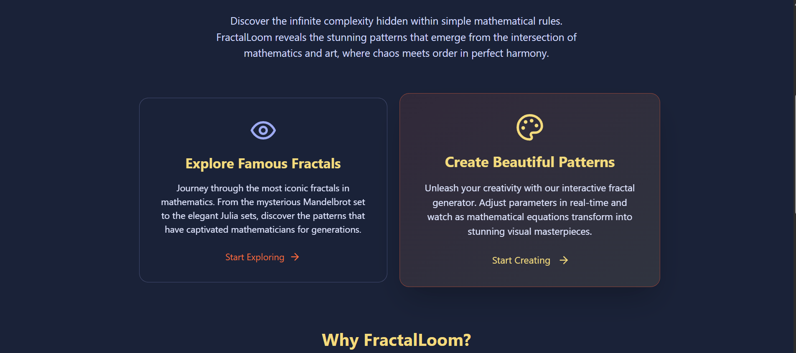
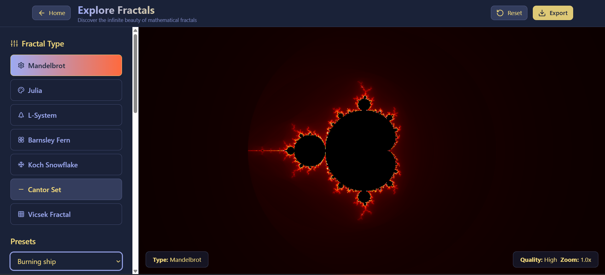
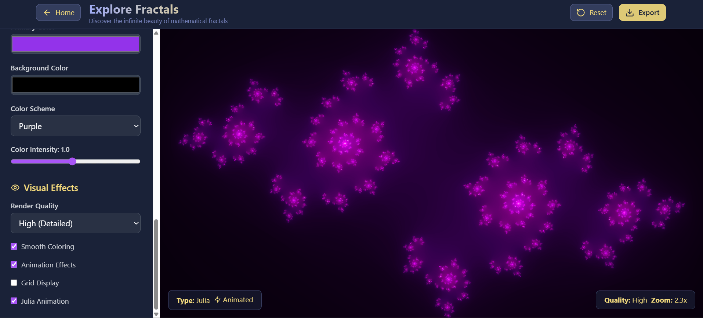
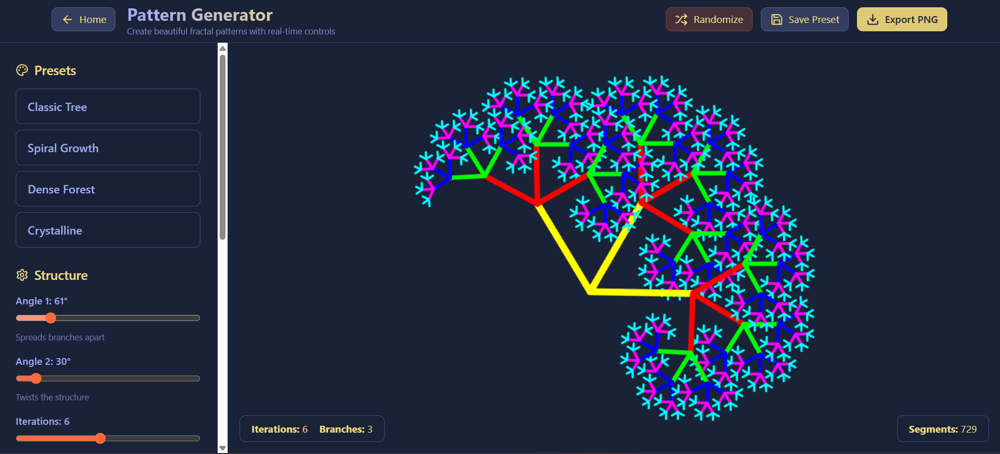
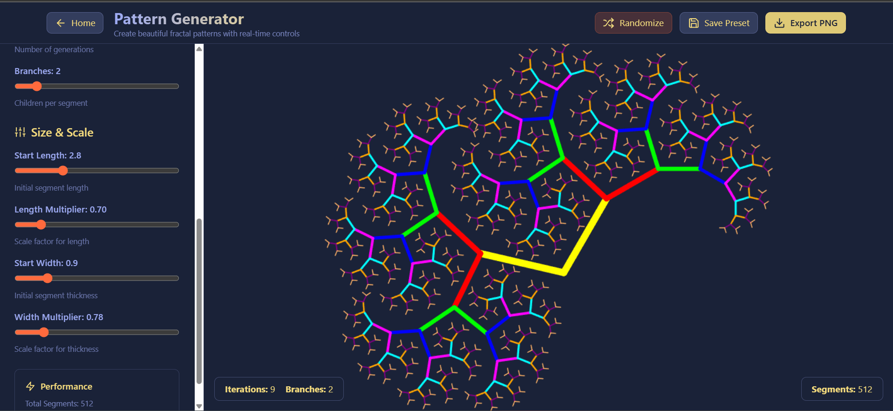

<div align="center">

# **FractalLoom**

### _Interactive Fractal Generator & Visualization Platform_

**Discover the infinite complexity hidden within simple mathematical rules**

[](https://github.com/Manthan-Vats/fractalloom)
[](https://reactjs.org/)
[](https://www.typescriptlang.org/)
[](LICENSE)

[**Live Demo**](#) • [**Documentation**](#usage) • [**Contributing**](#contributing)

</div>

---

## **What's This About?**

Ever played around with those mathematical tree patterns? You know, the ones that look like they could be actual plants? That's basically what FractalLoom does - it lets you mess around with fractal math without having to understand all the scary equations behind it.

I got obsessed with fractals after stumbling across some demos online. Turns out, you can create incredibly complex and beautiful patterns using just a few simple rules. The crazy part is how changing one tiny parameter can completely transform what you're looking at.

This tool is for anyone who's curious about math but doesn't want to wade through textbooks. Maybe you're studying for an exam, or you're an artist looking for inspiration, or you just think math art is cool. Either way, you can create some pretty stunning stuff here.

> _"Honestly, I built this because I kept getting lost in fractal rabbit holes at 2 AM. There's something weirdly satisfying about watching a simple tree pattern turn into something that looks like it belongs in a sci-fi movie. Figured other people might enjoy the same kind of mathematical procrastination."_

---

## **How This Started**

So I was procrastinating on some other project and found this awesome [Interactive Fractal Tree demo by Visnos](https://www.visnos.com/demos/fractal). Spent like 3 hours just moving sliders around, watching trees turn into spirals and back again. The interactivity was what hooked me - being able to see math change in real-time instead of just staring at static images in textbooks.

The Visnos demo was great, but I kept wanting more. Like, what about the famous fractals I'd heard about? The Mandelbrot set, Julia sets, all that stuff. Plus I was learning React at the time and thought it would be a fun challenge to rebuild the tree generator from scratch and add more features.

Started as a weekend project, obviously got way out of hand. Now it's got the interactive pattern generator (definitely inspired by Visnos but with my own twist), plus a whole section for exploring the classic mathematical fractals. Kind of became my go-to project whenever I wanted to experiment with new web dev techniques.

---

## **What You Can Do**

### **The Pattern Generator - Where the Fun Happens**

This is the main event. Eight sliders that control how your fractal grows. Sounds simple, but the combinations are endless. Start with a basic tree shape, then watch it morph into spirals, geometric patterns, or something that looks like it came from an alien planet.

**The controls you get:**

- **Branches** - How many arms split off each point
- **Start Length & Length Multiplier** - Makes branches get smaller as they grow
- **Start Width & Width Multiplier** - Controls how thick/thin the lines get
- **Angle 1 & Angle 2** - The secret sauce that creates all the different shapes
- **Iterations** - How detailed you want to get (warning: high numbers might slow things down)

**Got some presets to get you started:**

- **Classic Tree** - Looks like an actual tree
- **Spiral Growth** - Swirly and organic looking
- **Dense Forest** - Super complex layered stuff
- **Crystalline** - Sharp and geometric

### **Mathematical Fractal Explorer**

The famous ones you might have heard about. Mandelbrot set, Julia sets, and some others. These are the fractals that mathematicians get excited about. Each one has its own weird properties and infinite complexity.

### **Real-time Everything**

Change a slider, see it update immediately. Export your creations as high-res images. Save your work. The usual stuff you'd expect from a modern web app.

### **Actually Understanding What's Happening**

I tried to explain the math without making it boring. Each fractal type has some background info so you're not just looking at pretty pictures without knowing why they work.

---

## **Tech Stack**

<div align="center">


</div>

React for the UI (obviously), TypeScript because I hate debugging JavaScript errors, Vite for fast development builds. React Router handles the navigation between different sections. Tailwind for styling without writing custom CSS. WebGL for the heavy lifting on fractal rendering - regular canvas was too slow for complex iterations. Lucide React for clean icons.

---

## **Getting Started**

Need Node.js 16 or newer.

```bash
# Get the code
git clone https://github.com/Manthan-Vats/fractalloom.git
cd fractalloom

# Install stuff
npm install

# Run it
npm run dev
```

Open `http://localhost:5173` and start playing around.

To build for production:

```bash
npm run build
npm run preview
```

## **Known Issues**

- High iteration counts (15+) might make your browser sad
- Mobile experience could be better (working on it)
- Export function occasionally hiccups - just refresh if it acts weird
- Some fractals take a while to render on older devices

## **TODO**

- [ ] Better mobile controls
- [ ] More fractal types (suggestions welcome!)
- [ ] Color customization
- [ ] Animation export
- [ ] Maybe add sound? (weird idea but could be cool)

---

## **See It In Action**

<div align="center">











</div>

---

## **How to Use This Thing**

### **Playing with the Pattern Generator**

Click "Create Beautiful Patterns" and you'll see eight sliders. Start with one of the presets if you want - "Classic Tree" is a safe bet. Then just start moving sliders and see what happens.

Pro tip: small changes in the angle sliders can create dramatically different results. The iteration slider controls detail level - higher numbers look cooler but might slow things down.

The fun part is there's no wrong way to do it. Just experiment until you find something that looks cool.

### **Exploring the Math Fractals**

The other section has the famous mathematical fractals. Pick one, then zoom around and see the infinite detail. The Mandelbrot set is probably the most well-known - those colorful boundaries are where the math gets interesting.

Julia sets are similar but each one is different. The L-system ones (like the Barnsley Fern) show how simple rules can create complex organic-looking patterns.

### **Exporting Your Work**

Found something you like? Hit the export button for a high-res PNG. Good for wallpapers, art projects, or just showing off to friends.

---

## **What You Can Use This For**

**Art projects:** The patterns make great backgrounds or design elements. Since they're mathematically generated, you get unique results every time.

**Learning:** If you're studying fractals or math in general, this makes the abstract concepts more concrete. Way better than staring at equations in a textbook.

**Teaching:** Teachers can use this to demonstrate mathematical concepts. Students can mess around with parameters and see what happens.

**Just for fun:** Sometimes you just want to make cool-looking mathematical art. Nothing wrong with that.

---

## **The Math Behind It**

For the curious: the pattern generator uses recursive branching algorithms. Each iteration applies the same transformation rules to create self-similar structures.

The mathematical fractals use escape-time algorithms (Mandelbrot, Julia sets) and L-system string replacement (organic patterns). All the heavy computation is done in real-time using optimized algorithms.

---

## **Shout-outs**

Big thanks to [Visnos Interactive Fractal Tree](https://www.visnos.com/demos/fractal) for the original inspiration. Their demo is what got me interested in interactive fractals in the first place.

---

## **License**

MIT License - do whatever you want with it.

---

## **Contact**

Built by me, Manthan Vats.

- **LinkedIn:** [Manthan Vats](www.linkedin.com/in/manthan-vats-102476359)
- **Email:** manthan.ralph17@gmail.com
- **Found a bug?** [Open an issue](https://github.com/Manthan-Vats/fractalloom/issues)

---

<div align="center">

**Like this project? Give it a star!**

_Made with way too much coffee and late-night coding sessions_

</div>
